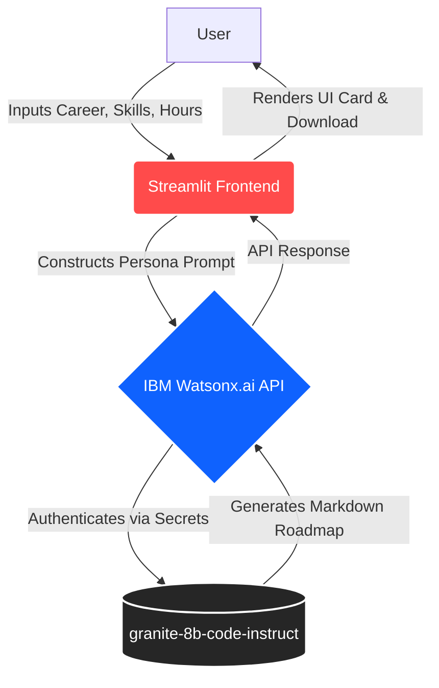

# 🎓 LearnMate: AI-Powered Course Pathway Generator


**LearnMate** is an elite technical academic coach and curriculum architect designed to produce hyper-personalized, actionable learning roadmaps. By analyzing a user's target career, current skill level, and weekly availability, LearnMate dynamically generates month-by-month study plans using IBM's Granite foundation models.

---

## 🏗️ System Architecture

The application is built on a lightweight, serverless architecture utilizing Streamlit for the frontend and IBM Watsonx.ai for the backend LLM inference.


## ✨ Core Features

* **📊 Skill Gap Analysis:** Automatically cross-references existing skills against target career requirements to identify high-priority learning gaps.
* **🗓️ Phased Curriculum:** Generates a structured, month-by-month learning plan calibrated strictly to the user's available weekly hours.
* **🏗️ Capstone Projects:** Suggests 2-3 substantial, portfolio-worthy project ideas tailored to the target role.
* **📈 Progress Evaluation:** Provides a concrete framework of weekly check-ins and monthly milestone gates.
* **💾 Exportable:** Users can download their personalized roadmap instantly as a formatted Markdown `.md` file.

---

## 🛠️ Technology Stack

* **Frontend:** Streamlit
* **Backend / AI:** IBM Watsonx.ai (`ibm/granite-8b-code-instruct`)
* **Environment Management:** `python-dotenv`

---

## 🚀 Local Installation & Setup

If you wish to run this project locally, follow these steps:

**1. Clone the repository**

```bash
git clone [https://github.com/yourusername/LearnMate-AI-Agent.git](https://github.com/yourusername/LearnMate-AI-Agent.git)
cd LearnMate-AI-Agent

```

**2. Create a virtual environment**

```bash
python -m venv .venv
source .venv/bin/activate  # On Windows use: .venv\Scripts\activate

```

**3. Install dependencies**

```bash
pip install -r requirements.txt

```

**4. Configure Environment Variables**

* Create a file named `.env` in the root directory.
* Use the `.env.example` file as a template and add your IBM Cloud credentials:

```env
IBM_API_KEY=your_ibm_cloud_api_key_here
IBM_PROJECT_ID=your_watsonx_project_id_here
IBM_URL=[https://au-syd.ml.cloud.ibm.com](https://au-syd.ml.cloud.ibm.com)

```

**5. Run the Application**

```bash
streamlit run app.py

```

---

## ☁️ Cloud Deployment (Streamlit Community Cloud)

This application is designed for seamless deployment on Streamlit Community Cloud.

1. Connect your GitHub repository to Streamlit.
2. Under **Advanced Settings**, input your environment variables into the **Secrets** vault in TOML format:
```toml
IBM_API_KEY="your_api_key"
IBM_PROJECT_ID="your_project_id"
IBM_URL="your_url"

```


3. Deploy the application.

---

## 👨‍💻 Author

**Saswat Jena** *M.Tech in Artificial Intelligence & Data Science*
